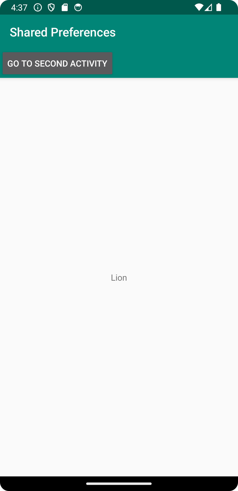

# Rapport 
Skapade en andra aktivitet vid namn SecondActivity och definiera layouten för den i 
"activity_second.xml". 

Sedan möjliggjordes det så att det går att öppna och stänga den andra aktiviteten genom att 
implementera en knapp som vidar-dirigerar en till den andra aktiviteten i filen "activity_main.xml" 
och en knapp som stänger den andra aktiviteten i filen "activity_second.xml".

Därefter lades det till en EditText element och en knapp som sparar input 
från EditText som shared preference i filen "activity_second.xml" för att uppdatera TextView 
elementets innehåll som finns i huvudaktiviteten. 

För att kunna uppdatera och spara inputten krävdes det implementation av shared preferences 
som skedde i filerna "MainActivity.java" och "SecondActivity.java".

Kod för att uppdatera innehållet i TextView (MainActivity.java):

```
 public void onResume() {
     super.onResume();
     myPreferenceRef = getSharedPreferences("myPreferences", MODE_PRIVATE);
     myPreferenceEditor = myPreferenceRef.edit();

     TextView textView = new TextView(this);
     textView=(TextView)findViewById(R.id.myTextView);
     textView.setText(myPreferenceRef.getString("myPreferenceString", "No preference found."));
     Log.d("Tag", "update on resume");
 }

```


